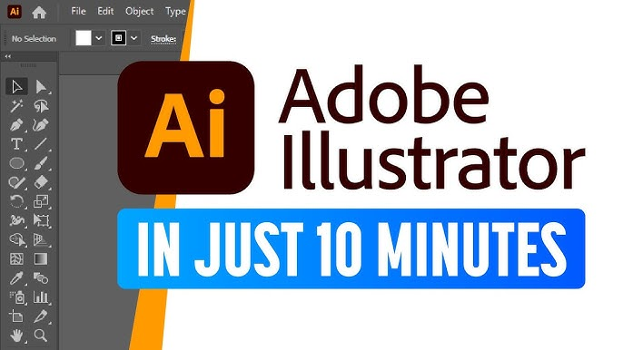
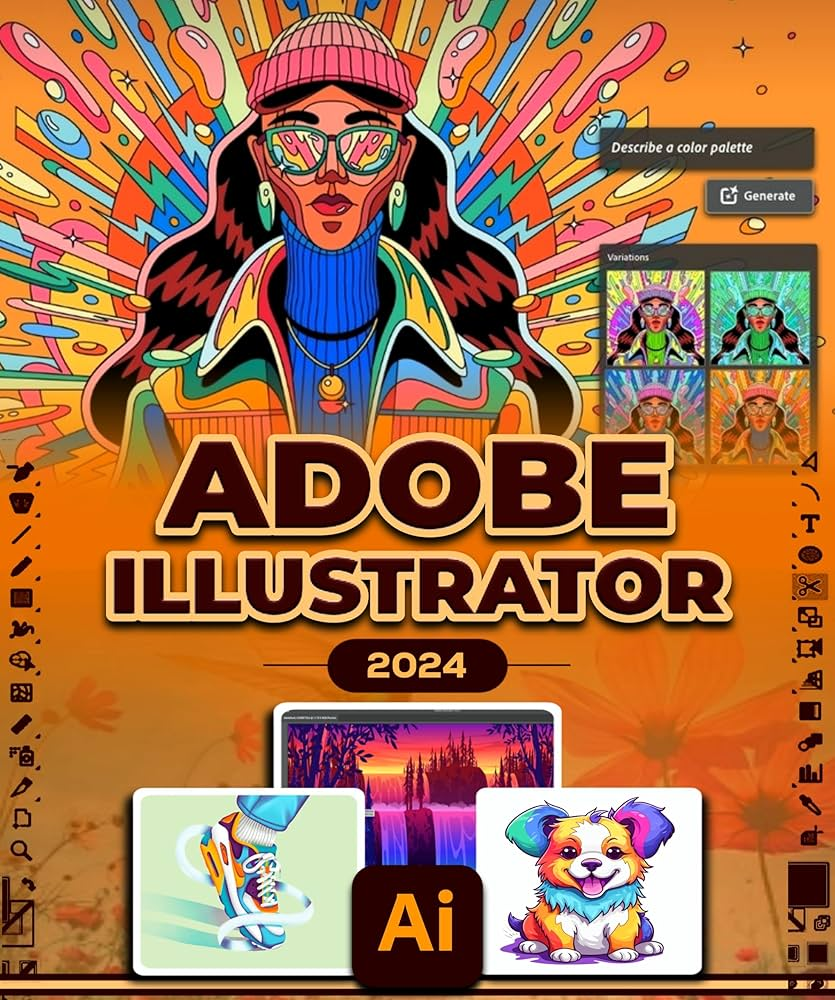
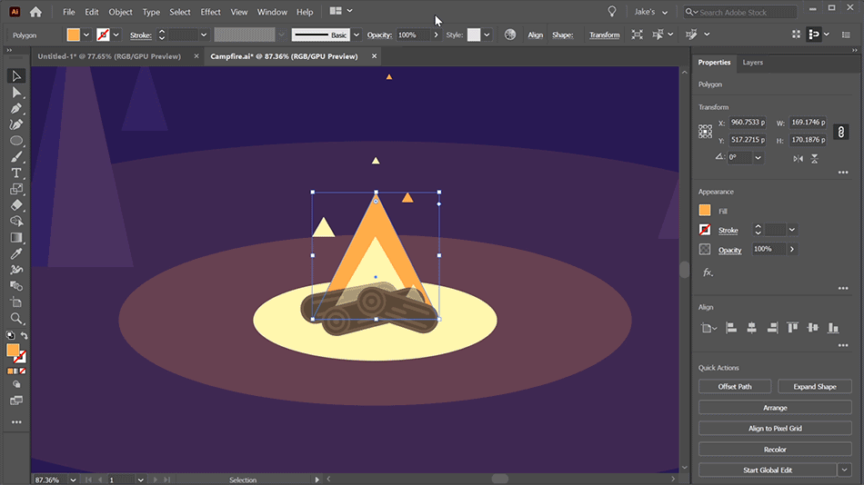
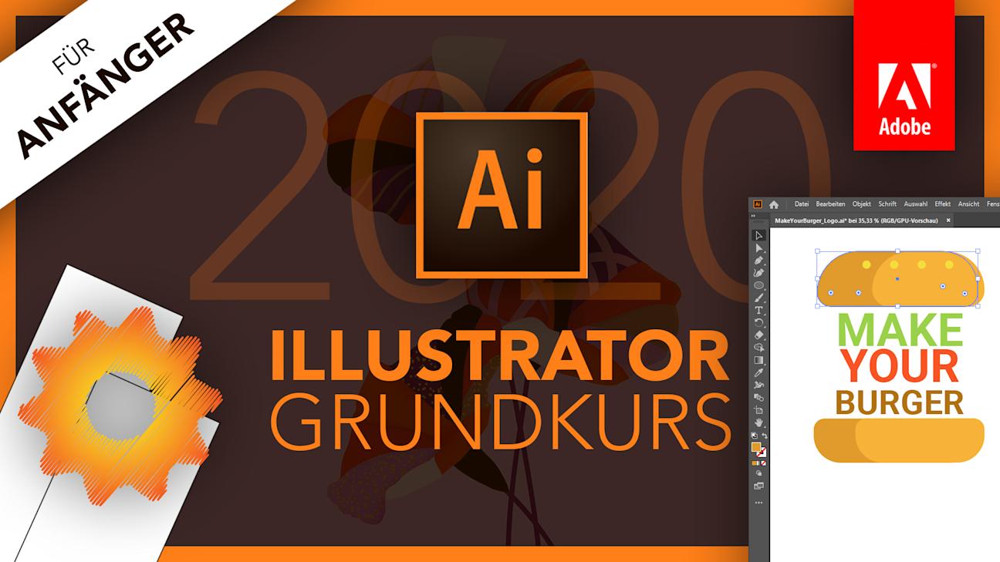

Welcome to **illustartor crack**! 🚀 This cutting-edge solution delivers unparalleled **illustrator free** capabilities, ensuring top-notch software quality and reliability. Empower your projects with robust features and experience seamless performance today!

## 🌟 Benefits of Using **illustartor crack**

- 🚀 **Professional Software Capabilities**  
  With **illustartor crack**, users gain access to advanced tools designed for top-tier performance. These capabilities ensure that even the most complex tasks are handled with ease, empowering you to achieve **adobe illustrator** results in no time. 

- 🎨 **User-Friendly Interface**  
  Our intuitive design makes **illustartor crack** accessible to everyone, regardless of experience level. The clean and responsive layout allows users to navigate effortlessly, ensuring productivity without the learning curve.

- 🔧 **Regular Updates and Improvements**  
  Stay ahead of the curve with frequent updates that introduce new features and optimizations. This commitment ensures that **illustartor crack** remains cutting-edge and aligned with your evolving needs. 

- 👨‍💻 **Technical Support Availability**  
  Need help? Our dedicated support team is always ready to assist you. Whether it’s troubleshooting or guidance, you can rely on expert assistance to keep your **adobe illustrator** projects running smoothly.

## 🛠️ Support for **illustartor crack**

Need help with **illustartor crack**? We’ve got you covered! Here's how you can get the support you need:

### 🌟 Technical Support Availability
Our dedicated team ensures round-the-clock assistance for all your **adobe illustrator**-related queries. Whether it’s troubleshooting or optimization, we’re here to assist you every step of the way.

### 📚 Documentation and Resources
Access comprehensive guides, tutorials, and FAQs tailored specifically for **illustartor crack** users. Our documentation is regularly updated to reflect the latest features and improvements.

### 💬 Community Forums
Join our vibrant community forum where developers and enthusiasts collaborate, share insights, and solve problems together. Engage with fellow **adobe illustrator** users and expand your knowledge!

### ⏳ Update and Maintenance
We prioritize reliability and performance. Regular updates ensure that **illustartor crack** remains robust and secure. Rest assured, maintenance schedules are communicated in advance to minimize disruptions.

---

  
Click now to explore more resources and connect with our community!

## 🚀 Features of **illustartor crack**

- 🛠️ **Advanced Functionality and Tools**  
  Leverage the power of **illustartor crack** with its cutting-edge tools designed for efficiency and precision. These advanced features ensure that users can tackle complex tasks effortlessly, enhancing productivity while maintaining high performance standards.

- 👥 **User-Friendly Interface**  
  Experience seamless navigation with the intuitive design of **adobe illustrator**. The software prioritizes ease of use, making it accessible for both beginners and experts alike, ensuring a smooth learning curve and enjoyable user experience.  
  

- 💼 **Professional-Grade Features**  
  With **illustartor crack**, professionals can rely on robust capabilities tailored to meet industry demands. From data analysis to project management, the software delivers top-tier functionality to support your business needs.

- 🔄 **Regular Updates and Support**  
  Stay ahead with consistent updates that introduce new features and improve existing ones. Our dedicated team provides reliable support, ensuring that **adobe illustrator** remains a trusted solution for all your requirements.

- 🔗 **Integration Capabilities**  
  Seamlessly integrate **illustartor crack** with other platforms and tools to create a cohesive workflow. This flexibility allows businesses to optimize their operations and maximize resource utilization.  
  

Ready to explore these incredible features? Click below to get started!  

